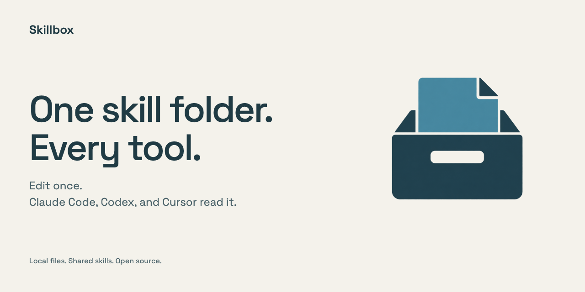
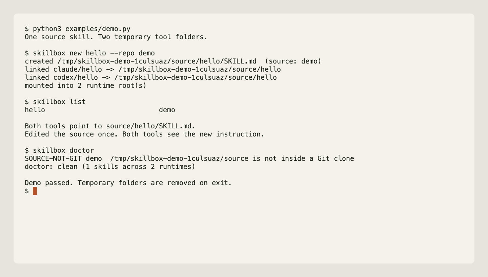

# Skillbox

**One skill folder. Every tool.**

Link your skills into Claude Code, Codex, and Cursor. Edit the source once.
Each tool reads the same files.



[Watch the demo](docs/skillbox-demo.mp4) · [Command reference](docs/reference.md) · [MIT license](LICENSE)

## See it with your coding agent

Clone Skillbox into a disposable workspace, open that workspace in Claude Code
or Codex, and give it this prompt:

> Show me how Skillbox shares one skill with Claude Code and Codex. Use isolated
> example folders, edit the source, and prove both tools see the change.

The useful proof is concrete: one source `SKILL.md`, links in temporary Claude
Code and Codex skill folders, then one source edit visible through both links.
Keep the manifest and state directory inside the example folder via
`SKILLBOX_MANIFEST` and `SKILLBOX_STATE_DIR`; this leaves your installed skills
and configuration untouched. Skillbox creates the links—it does not start or
configure either coding agent.

## Preview the linking behavior

Python 3.11 or later, on macOS or Linux.

```sh
git clone https://github.com/firstbitelabsllc/skillbox.git
cd skillbox
python3 examples/demo.py
```

This local preview creates one skill and links it into two temporary folders.
It checks that both links read the same file, edits that file, and checks that
both see the new instruction. The temporary folders are removed when it
finishes. `SOURCE-NOT-GIT` is expected because its temporary source is a plain
folder; use a Git clone for skills you want to version and share.

For the full command reference, read [docs/reference.md](docs/reference.md).

## Use your own skills

Add the command to your PATH. Installation links to this clone, so keep it in place.

```sh
mkdir -p ~/.local/bin ~/.skillbox
ln -s "$PWD/bin/skillbox.py" ~/.local/bin/skillbox
export PATH="$HOME/.local/bin:$PATH"
```

Create or edit `~/.skillbox/skills.toml` with the folders you use:

```toml
[roots]
claude = "~/.claude/skills"
codex = "~/.agents/skills"
cursor = "~/.cursor/skills"

[sources.personal]
path = "~/src/my-skills/skills"
priority = 1
```

Point `path` at your existing source folder. It should contain one directory
per skill, each with a `SKILL.md`. Then link and check:

```sh
skillbox sync --no-pull
skillbox doctor
```

Read the source before mounting it. Skillbox checks links and source health;
it does not vet what a skill tells an agent to do. Existing real folders are
preserved, but symlinks in configured skill slots may be replaced.

## Everyday commands

```sh
skillbox new explain --repo personal  # create a skill and link it
skillbox list                        # show skills and their source
skillbox doctor                      # check links and source health
skillbox update --dry-run            # fetch and preview source changes
```

An npm package also uses the name `skillbox`. If the command looks different,
check `command -v skillbox` and put `~/.local/bin` first on PATH.

[More commands and configuration](docs/reference.md) · [Security boundaries](SECURITY.md)

For a bug report, include the command, its output, and the smallest manifest
that reproduces the problem. [Open an issue](https://github.com/firstbitelabsllc/skillbox/issues).
Run the existing checks with `bash tests/run_all.sh`.
